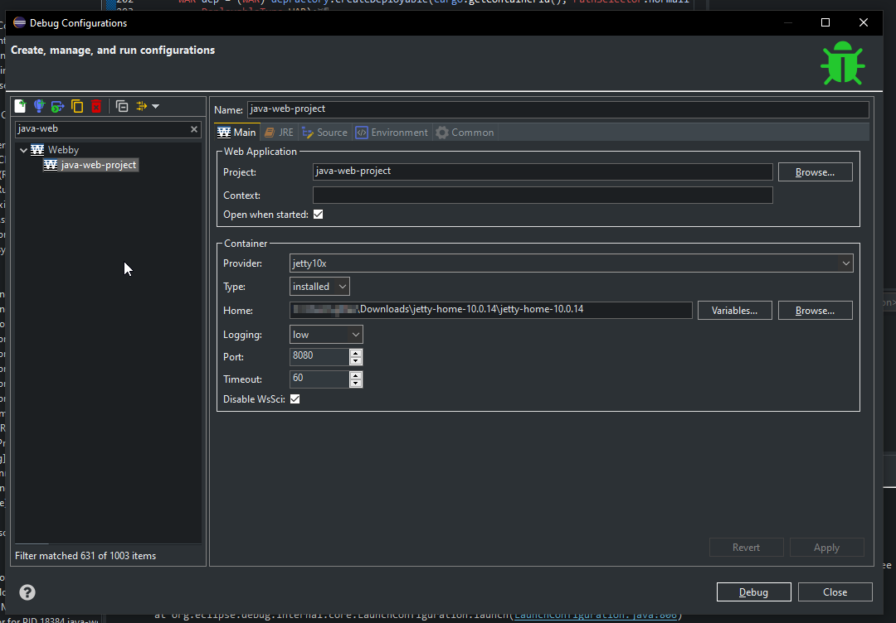
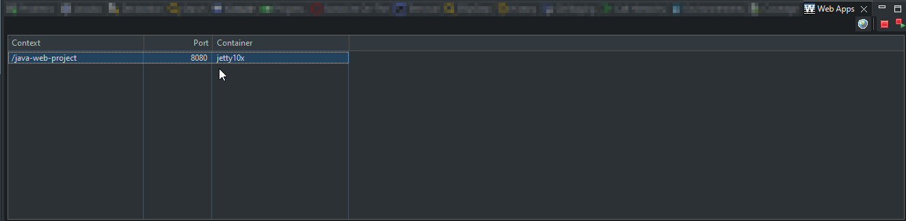

# Webby: a Web Application Runner for Maven WAR Projects

[](https://github.com/tesla/m2eclipse-webby/actions/workflows/build.yml)
[](https://codecov.io/gh/tesla/m2eclipse-webby)
[](https://www.eclipse.org/legal/epl-v20.html)

Webby is an Eclipse plugin, built on [m2e](https://eclipse.dev/m2e/) and powered by
[Cargo](https://codehaus-cargo.github.io/cargo/Home.html), that runs and debugs Maven WAR projects in a servlet
container **without packaging the WAR file**. It provides a new launch configuration type, "Webby", that starts a
locally installed container on the exploded WAR assembled incrementally by Webby while you work in the IDE.

The primary focus of Webby is to allow running WAR projects without the time consumption of creating the actual WAR
file, yet supporting advanced features of the `maven-war-plugin` like resource filtering and overlays. Launched in
debug mode, the application benefits from Eclipse hot code replace: many changes to Java sources (servlets, …) are
applied on the fly without restarting the container.

> **Warning:** Webby cannot be installed side-by-side with the m2e-wtp extension. Trying to do so will render one or
> both of the extensions unusable.



## Installation

Install the "Web Application Launcher for M2Eclipse" feature from the update site:

* latest release: `https://github.com/tesla/m2eclipse-webby/releases/latest/download/`
* a specific release: `https://github.com/tesla/m2eclipse-webby/releases/download/$VERSION/`
* development build of `master`: `https://github.com/tesla/m2eclipse-webby/releases/download/latest/`

Requirements: Eclipse 2023-12 (4.30) or newer with m2e 2.x, running on Java 21 or newer.

## Supported containers

Webby relies on Cargo 1.10.29 and supports the following containers, installed in a local directory:

| Family    | Cargo ids                                                       |
|-----------|-----------------------------------------------------------------|
| Tomcat    | `tomcat8x`, `tomcat9x`, `tomcat10x`, `tomcat11x` (default)      |
| TomEE     | `tomee8x`, `tomee9x`, `tomee10x`                                |
| Jetty     | `jetty9x`, `jetty10x`, `jetty11x`, `jetty12x`                   |
| GlassFish | `glassfish5x`, `glassfish6x`, `glassfish7x`, `glassfish8x`      |

Tomcat 10.1, Tomcat 11 and Jetty 12 are exercised by the integration tests of every build.

## Usage

Right-click a Maven project with `war` packaging and choose **Run As > Run as Webby** or **Debug As > Debug as
Webby**, or create a "Webby" configuration in **Run > Run Configurations...**. The main tab lets you choose:

* the project and the context path (the artifact id by default),
* the container (provider) and its home directory, which may contain variables like `${env_var:TOMCAT_HOME}`,
* the HTTP port; the two following ports are used for AJP and RMI,
* the startup timeout, in seconds,
* the Cargo log level,
* "Disable WsSci" to skip the WebSocket initializer of Tomcat/TomEE, which speeds up the startup,
* whether to open the application in a browser once started.

The "JRE" tab additionally holds the VM arguments and the **System Properties Files**: each line gives the path to a
properties file, blank lines are ignored. The files are read in declared order and merged, latter files taking
precedence. The resulting properties are passed as system properties to the container JVM.

Once launched, the application is listed in the **Web Apps** view (**Window > Show View > Other... > Webby**), which
lets you open it in a browser (hold Ctrl/Cmd for the external browser), restart or stop it. Applications that do not
need an orderly shutdown can also be stopped by terminating their launch in the Console or Debug view.



## Building

The build requires Java 21; Maven is provided by the wrapper:

```shell
./mvnw clean verify
```

The update site is created in `sites/org.sonatype.m2e.webby.repository/target/repository`. The build runs:

* unit tests and SWTBot UI tests in an Eclipse workbench (use `xvfb-run ./mvnw clean verify` on a headless Linux),
* integration tests that import a sample WAR project into the workspace and run it in Tomcat 10.1, Tomcat 11 and
  Jetty 12, downloaded from Maven Central,
* a JaCoCo coverage report, in `releng/coverage/target/site/jacoco-aggregate`, which CI uploads to Codecov.

Use `-DskipTests` to skip the tests. The target platform (Eclipse 2026-09, m2e and SWTBot) is defined in
`releng/webby.target`. To develop Webby in Eclipse, open that file and click "Set as Active Target Platform", then
import the projects and run `./mvnw generate-resources` once to download the libraries embedded in the plugin.

## License

[Eclipse Public License, v2.0](https://www.eclipse.org/legal/epl-v20.html)
